# EzSearch

## 概要

EzSearchはディレクトリ内のテキストファイルを指定キーワードで検索することができるデスクトップツールです。Windows、macOS、Linuxで動作します。主に以下のような機能を持ちます。

- 正規表現を利用した検索
- 検索モードごとの絞り込み検索
- キーワードのハイライト表示
- 検索結果のHTML出力

## インストール

EzSearchはシングルバイナリだけで動作します。[Releases](https://github.com/pd-labs-admins/EzSearch/releases)ページから動作環境に併せたバイナリをダウンロードすればすぐに動作します。インストール作業や追加のランタイムソフトウェアのインストールは不要です。

## 検索の実行

ツールを実行したら「`Browse`」をクリックして検索したいファイルが保存されているディレクトリを指定します。もしくはツールに検索対象ディレクトリをドラッグ＆ドロップします。

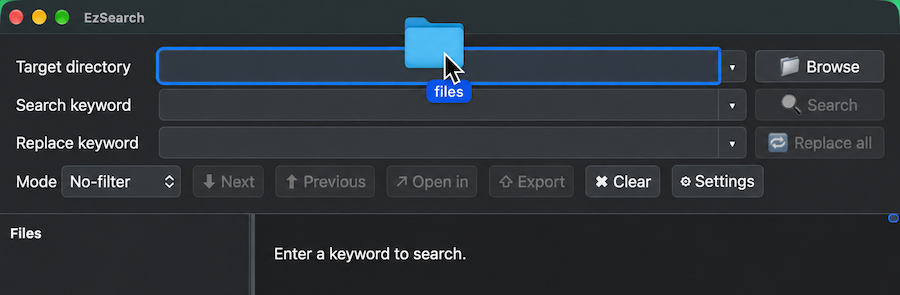

「`Search keyword`」に検索キーワードを入力します。`ENTER`キーを押すか、もしくは「`Delay seconds`」で指定した時間が経過すると検索が実行されます。検索キーワードと一致した部分はハイライトして表示されます。

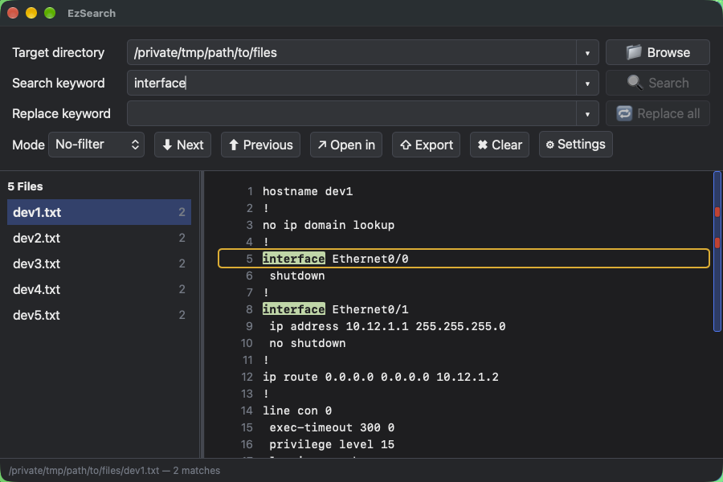

## 検索モード

検索モードには以下の種類があります。

| No. | 検索モード | 説明                                                                                               |
|-----|------------|----------------------------------------------------------------------------------------------------|
| 1   | No-filter  | 検索結果をフィルタせず、そのまま表示します。但し、キーワードと一致した部分はハイライト表示します。 |
| 2   | Include    | キーワードを含む行のみ、表示します。                                                               |
| 3   | Exclude    | キーワードを含まない行のみ、表示します。                                                           |
| 4   | Section    | キーワードを含む、下位のインデントを表示します。                                                   |
| 5   | Block      | キーワードを含む、上位のインデントを表示します。                                                   |
| 6   | Begin      | キーワードと一致した行からファイルの最後まで表示します。                                           |
| 7   | Until      | ファイルの先頭からキーワードと一致した行まで表示します。                                           |

実行例は以下の通りです。

### 1.No-filterモード

ファイルの中身をそのままフィルタせず、表示します。但し、キーワードと一致した部分はハイライトして表示します。

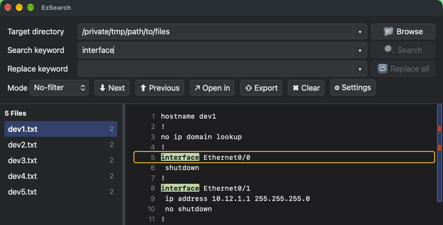

### 2.Includeモード

キーワードを含む行のみ、表示します。それ以外の行は表示しません。

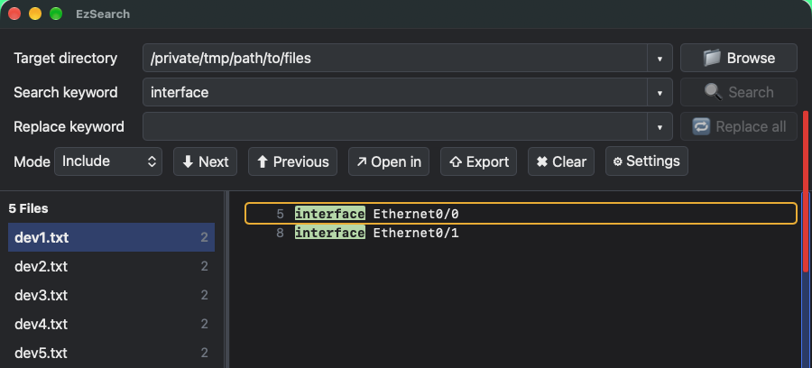

### 3.Excludeモード

キーワードを含まない行のみ、表示します。それ以外の行は表示しません。

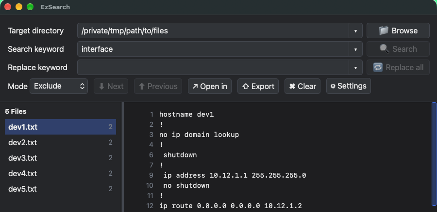

### 4.Sectionモード

キーワードを含む、下位のインデントを表示します。

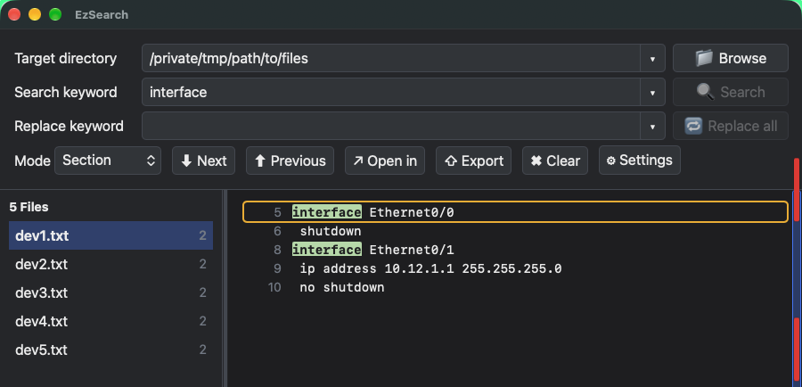

### 5.Blockモード

キーワードを含む、上位のインデントを表示します。

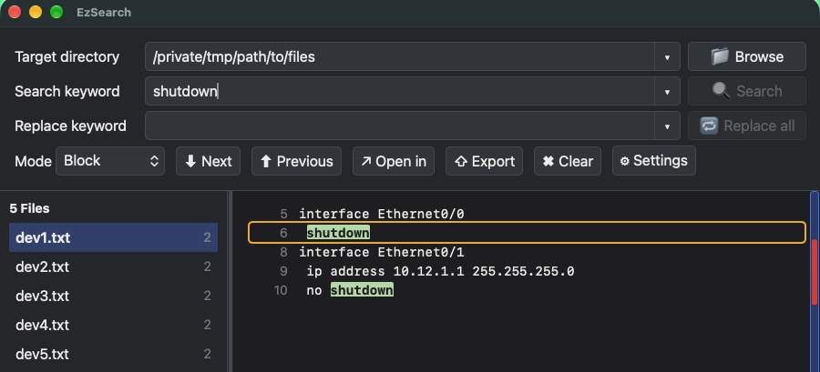

### 6.Beginモード

キーワードと一致した行からファイルの最後まで表示します。

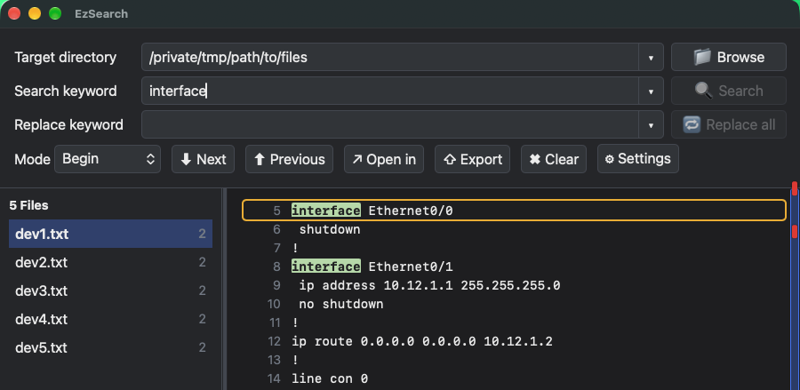

### 7.Untilモード

ファイルの先頭からキーワードと一致した行まで表示します。

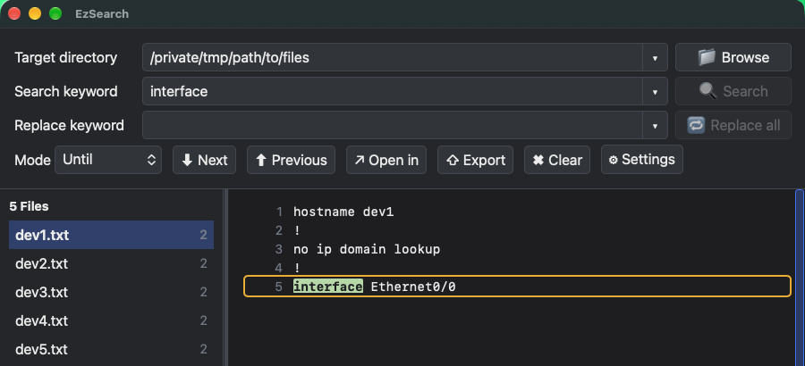

## 正規表現を使った検索

検索キーワードには正規表現を利用することができます(設定で無効化することもできます)。例えば「`interface` または `line` を含むセクションを表示したい」場合は検索モードを「`Section`」に設定し、検索キーワードには「`(interface|line)`」のように指定します。

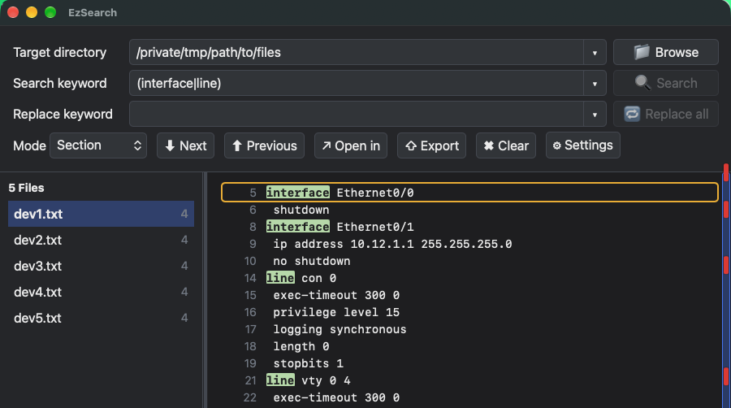

## 検索キーワードを移動する

「→」または「←」（カーソルキーの左右)を押すことで検索キーワードに一致した行を移動できます。

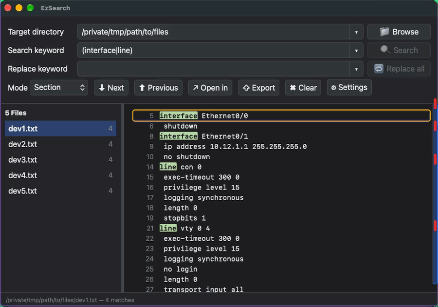

## 検索キーワードの上下行も表示する

検索結果にキーワードと一致した行の上下行も表示するには「`Context lines`」に表示したい行数を設定します(デフォルト：ゼロ)。

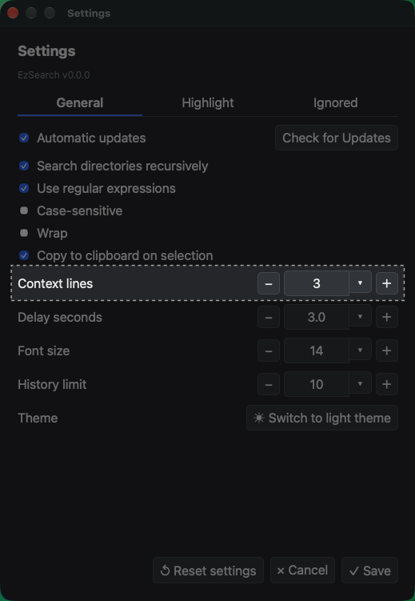

これでキーワードと一致した上下行も結果に表示されます(検索モードによって挙動は異なります)。

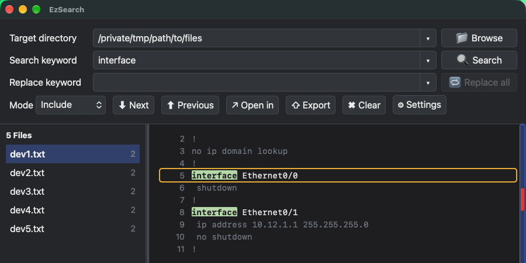

## 対象ファイルをアプリケーションで開く

参照中のファイルを普段利用しているエディタなどで開きたい場合は「`Open in`」をクリックします。

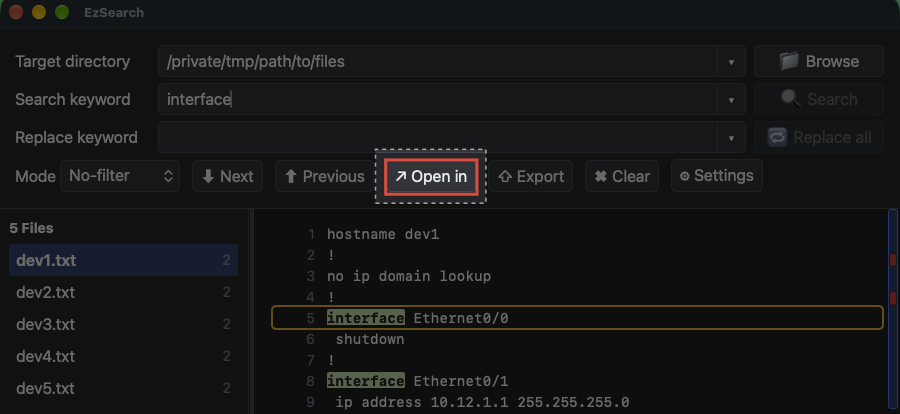

## 検索結果をHTMLファイルとして保存する

「`Export`」をクリックすることで検索結果をHTMLファイルとして保存することができます。

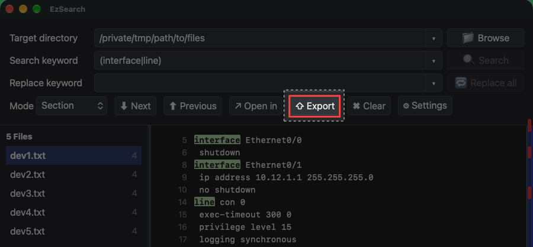

保存されたHTMLファイルをWebブラウザで開くと以下のように表示されます。

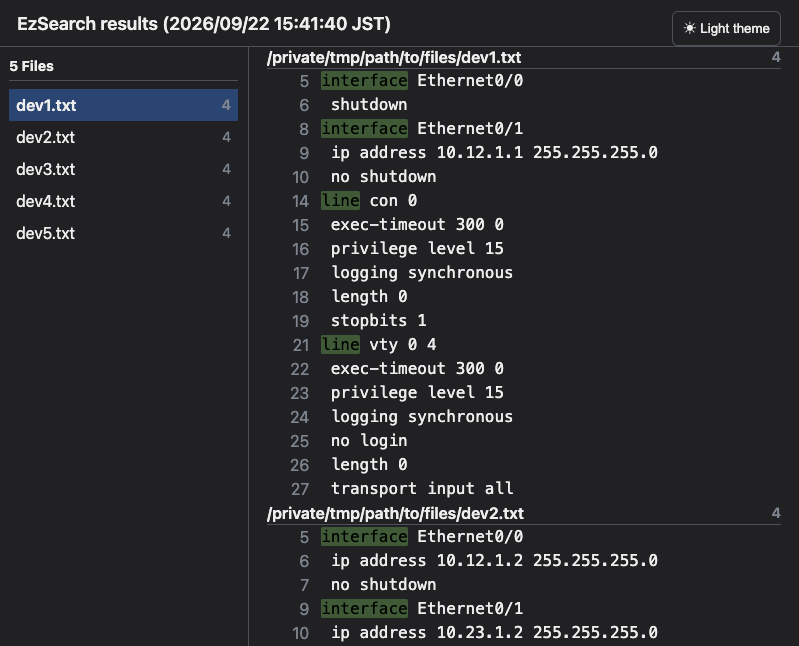

## キーワードを置換する

キーワードを一括置換するには「`Search keyword`」と「`Replace keyword`」を入力した状態で「`Replace all`」をクリックします。

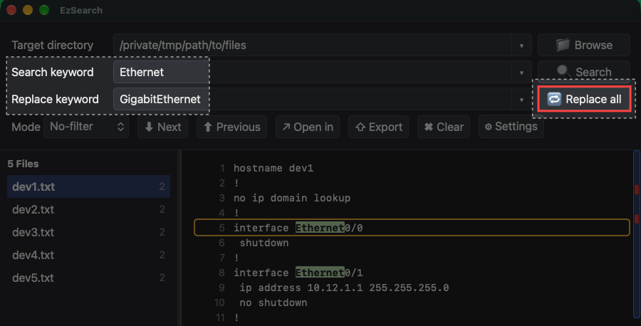

これで一括置換が実行されました。尚、一括置換後のファイルは自動的に上書き保存されます。重用なファイルを置換する際などは事前にバックアップを作成してください。

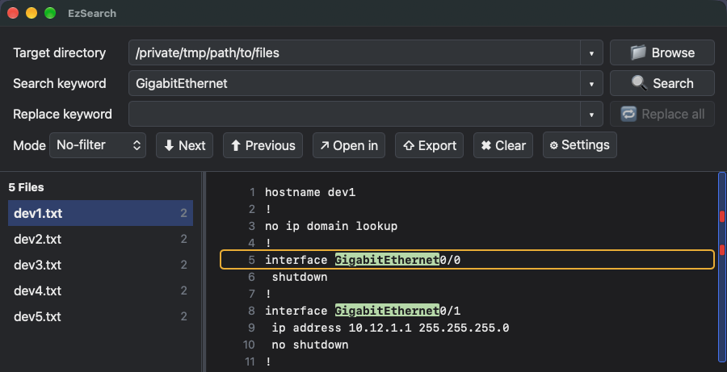

## 設定ファイル

OSごとに以下のパスへ設定ファイルが作成されます。

| OS | 設定ファイル |
| --- | --- |
| macOS / Linux | `~/.config/EzSearch/config.yml` |
| Windows | `%USERPROFILE%/.config/EzSearch/config.yml` |

GUI上の設定項目と設定ファイルの項目は以下のように対応します。

### Generalタブ

| GUI設定項目 | YAMLの設定名 | デフォルト値 | 説明 |
| --- | --- | --- | --- |
| Target directory | `target_directory` | `""` | 検索対象ディレクトリ。 |
| Automatic updates | `auto_update` | `true` | 起動時などに更新確認を行います。 |
| Use regular expressions | `regex` | `true` | 検索キーワードを正規表現として扱います。 |
| Case-sensitive | `case_sensitive` | `false` | 大文字と小文字を区別します。 |
| Search directories recursively | `recursive` | `true` | サブディレクトリを再帰的に検索します。 |
| Wrap | `wrap` | `false` | 長い検索結果行を折り返して表示します。 |
| Copy to clipboard on selection | `copy_on_selection` | `true` | 検索結果の選択範囲をクリップボードへコピーします。 |
| Context lines | `context_lines` | `0` | 一致行の前後に表示するコンテキスト行数です。 |
| Delay seconds | `delay_seconds` | `3` | 入力変更後に自動検索を開始するまでの秒数です。最小値は3秒です。 |
| History limit | `history_limit` | `10` | ディレクトリ・検索語・置換語の履歴件数です。 |
| Font size | `font_size` | `14` | 検索結果の文字サイズです。 |
| Theme | `theme` | `"system"` | テーマです。`system`、`light`、`dark`を指定できます。 |

### Highlightタブ

| GUI設定項目 | YAMLの設定名 | デフォルト値 | 説明 |
| --- | --- | --- | --- |
| Match | `match_color` | `"#78b85a"` | 検索キーワードに一致した部分の色です。 |
| Enable highlighting for fixed keywords | `highlight_fixed_keywords` | `true` | High、Middle、Lowの固定キーワード強調を有効にします。 |
| High（キーワード） | `highlight_high` | `Emergency`, `Alert`, `Critical`, `Fatal`, `Error`, `Fault` | 高重要度として強調するキーワード一覧です。 |
| High（色） | `highlight_high_color` | `"#e53935"` | Highキーワードの色です。 |
| Middle（キーワード） | `highlight_middle` | `Warning`, `Warn` | 中重要度として強調するキーワード一覧です。 |
| Middle（色） | `highlight_middle_color` | `"#f28c28"` | Middleキーワードの色です。 |
| Low（キーワード） | `highlight_low` | `Notice`, `Informational`, `Info`, `Debug`, `Trace` | 低重要度として強調するキーワード一覧です。 |
| Low（色） | `highlight_low_color` | `"#e6b800"` | Lowキーワードの色です。 |

### Ignoredタブ

| GUI設定項目 | YAMLの設定名 | デフォルト値 | 説明 |
| --- | --- | --- | --- |
| Ignored files | `ignored_files` | `*.db`, `*.dll`, `*.dylib`, `*.exe`, `*.gif`, `*.jpeg`, `*.jpg`, `*.out`, `*.png`, `*.rar`, `*.retry`, `*.so`, `*.webp`, `*.zip`, `*.docx`, `*.docm`, `*.doc`, `*.xlsx`, `*.xlsm`, `*.xls`, `*.pptx`, `*.pptm`, `*.ppt`, `*.accdb`, `*.mdb`, `*.pst`, `*.ost`, `*.one`, `*.pub`, `*.vsd`, `*.vsdx`, `.DS_Store`, `.Trashes`, `Thumbs.db`, `desktop.ini`, `$RECYCLE.BIN` | 検索対象から除外するファイル名・拡張子のパターン一覧です。 |

## ショートカットキー一覧

アプリケーション全体では以下のショートカットキーを利用することができます。

| ショートカット1 | ショートカット2 | 説明                                   |
|-----------------|-----------------|----------------------------------------|
| PageDown        | Ctrl+Tab        | 次のファイルへ移動                     |
| PageUp          | Ctrl+Shift+Tab  | 前のファイルへ移動                     |
| End             | -               | 検索結果の最後へ移動                   |
| Home            | -               | 検索結果の先頭へ移動                   |
| →               | Ctrl+N          | 次のキーワードへ移動                   |
| ←               | Ctrl+P          | 前のキーワードへ移動                   |
| ↓               | -               | 検索結果を下にスクロール               |
| ↑               | -               | 検索結果を上にスクロール               |
| Cmd+F           | Ctrl+F          | フォーカスを「検索キーワード」欄へ移動 |
