# EzSearch

## 概要

EzSearchはディレクトリ内のテキストファイルを指定キーワードで検索することができるデスクトップツールです。Windows、macOS、Linuxで動作します。主に以下のような機能を持ちます。

- 正規表現を利用した検索
- 検索モードごとの絞り込み検索
- キーワードのハイライト表示
- 検索結果のHTML出力
- ふたつファイルの比較機能(Diff)

## インストール

EzSearchはシングルバイナリだけで動作します。[Releases](https://github.com/pd-labs-admins/EzSearch/releases)ページから動作環境に併せたバイナリをダウンロードすればすぐに動作します。インストール作業や追加のランタイムソフトウェアのインストールは不要です。

## 検索の実行

ツールを実行したら「`Open`」(Ctrl+O)をクリックして検索したいファイルが保存されているディレクトリを指定します。もしくはツールに検索対象ディレクトリをドラッグ＆ドロップします。

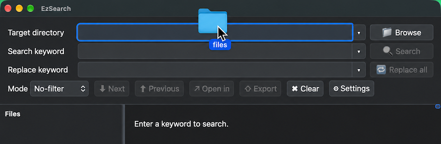

「`Search keyword`」に検索キーワードを入力します。`ENTER`キーを押すか、もしくは「`Delay seconds`」で指定した時間が経過すると検索が実行されます。検索キーワードと一致した部分はハイライトして表示されます。

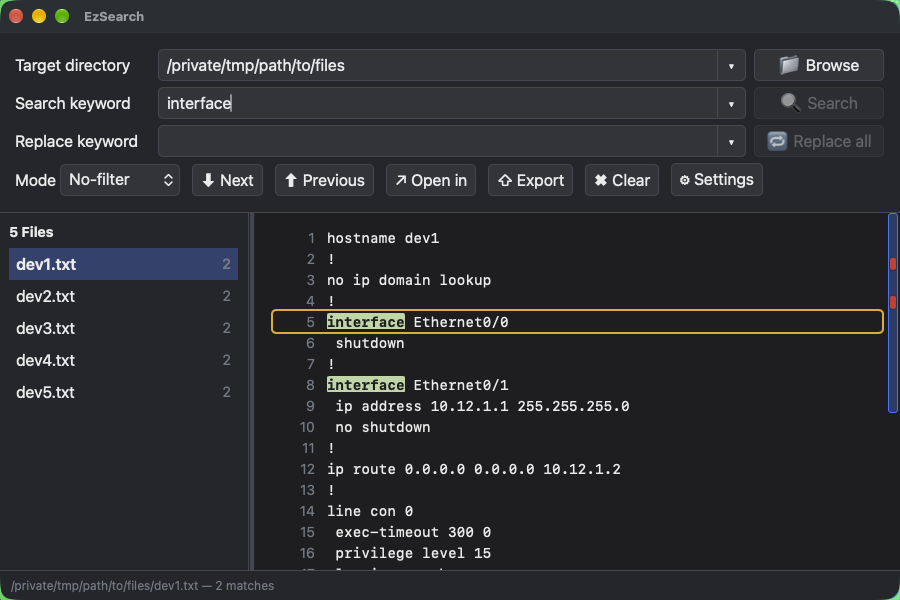

## 検索モード

検索モードには以下の種類があります。

| No. | 検索モード | 説明                                                                                               |
|-----|------------|----------------------------------------------------------------------------------------------------|
| 1   | No-filter  | 検索結果をフィルタせず、そのまま表示します。但し、キーワードと一致した部分はハイライト表示します。 |
| 2   | Include    | キーワードを含む行のみ、表示します。                                                               |
| 3   | Exclude    | キーワードを含まない行のみ、表示します。                                                           |
| 4   | Section    | キーワードを含む、下位のインデントを表示します。                                                   |
| 5   | Block      | キーワードを含む、上位のインデントを表示します。                                                   |
| 6   | Begin      | キーワードと一致した行からファイルの最後まで表示します。                                           |
| 7   | Until      | ファイルの先頭からキーワードと一致した行まで表示します。                                           |

実行例は以下の通りです。

### 1.No-filterモード

ファイルの中身をそのままフィルタせず、表示します。但し、キーワードと一致した部分はハイライトして表示します。

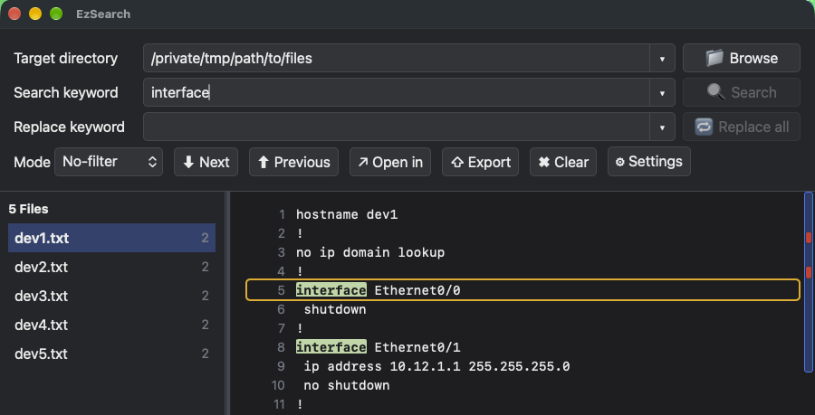

### 2.Includeモード

キーワードを含む行のみ、表示します。それ以外の行は表示しません。

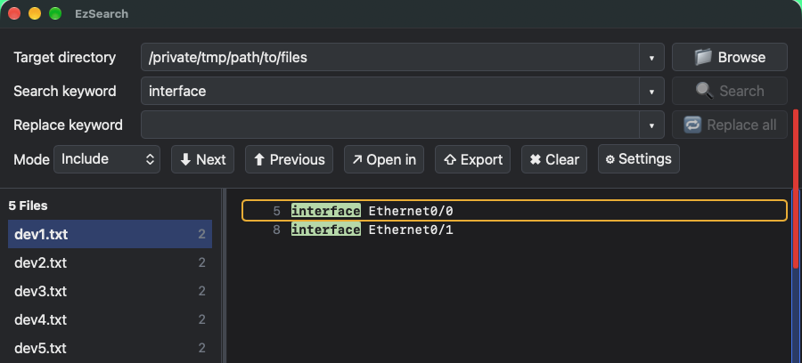

### 3.Excludeモード

キーワードを含まない行のみ、表示します。それ以外の行は表示しません。

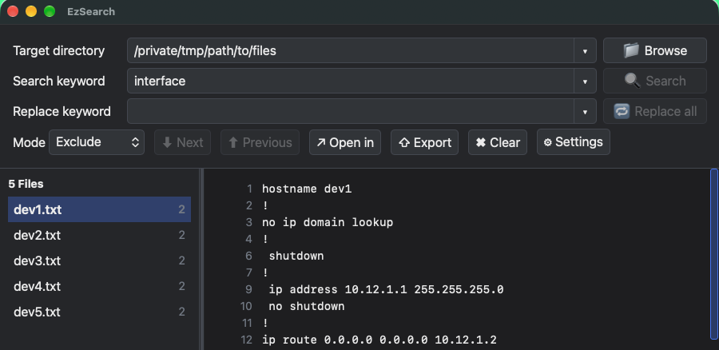

### 4.Sectionモード

キーワードを含む、下位のインデントを表示します。

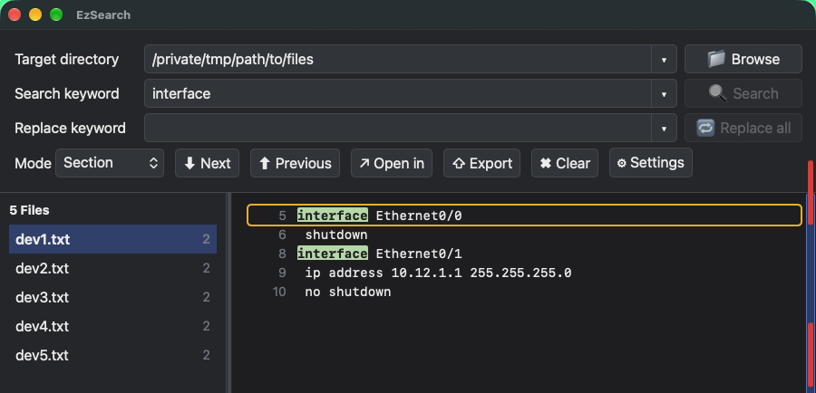

### 5.Blockモード

キーワードを含む、上位のインデントを表示します。

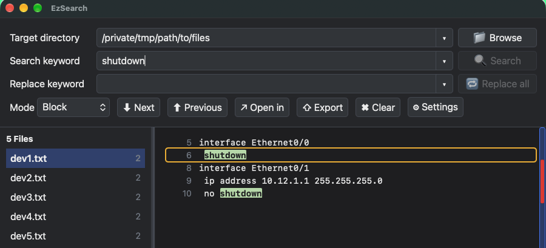

### 6.Beginモード

キーワードと一致した行からファイルの最後まで表示します。

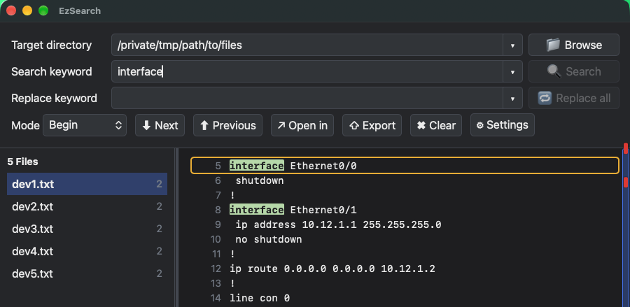

### 7.Untilモード

ファイルの先頭からキーワードと一致した行まで表示します。

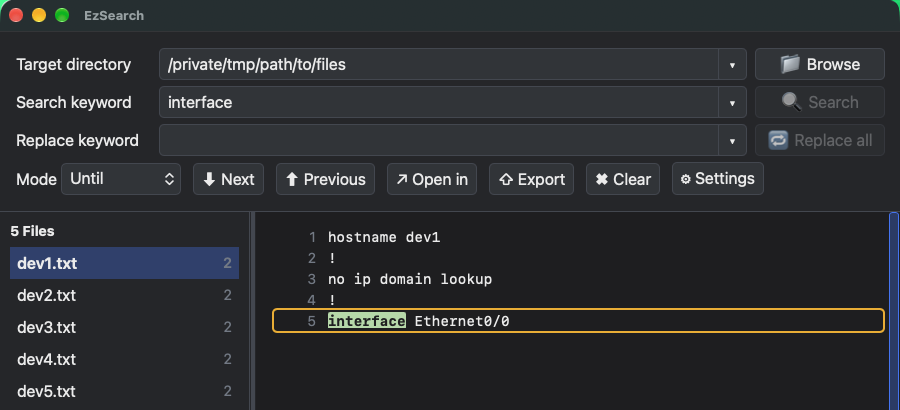

## Typeによるキーワードの色分け

メインウインドウの「`Type`」で種類を選択すると、その種類で定義されたキーワードの文字に色が付きます。文字色はキーワードごとに自動生成され、ライトテーマ・ダークテーマそれぞれで見づらい色は使用されません。検索キーワードとの一致部分は背景色で強調されるため、Typeのキーワードとは区別して表示されます。キーワードは大文字・小文字を区別せず、単語単位で一致します。同じ位置から複数のキーワードが一致する場合は長い方を優先します(例: `spanning-tree`は`spanning`より優先)。インターフェイス名は後に続くインターフェイス番号も含めて色が付きます(例: `GigabitEthernet1/0/1`、`Ethernet1/1`、`Bundle-Ether1.100`、`port1`)。`show`コマンドの出力で使われる短縮形(`Gi1/0/1`、`Te1/1/1`、`Po10`、`Eth1/1`など)も対象です。

「`-`」以外のTypeを選択すると、正しい表記のIPアドレス・IPネットワークにも色が付きます(例: `11.22.33.44`、`11.22.33.44/24`、`2001:db8::1`、`2001:db8::/32`)。`111.222.333.444`(範囲外の値)、`11.22.33.44/33`(範囲外のプレフィックス長)、`1.2.3.4.5`、`01.2.3.4`(先頭が0)のようにIPアドレスとしてありえない表記には色が付きません。

| Type | 色を付けるキーワード |
| --- | --- |
| - | (色を付けません) |
| Syslog | `Alert`, `Critical`, `Debug`, `Emergency`, `Error`, `Fatal`, `Fault`, `Info`, `Informational`, `Notice`, `Trace`, `Warn`, `Warning` |
| A10 Networks | A10 Networks ACOS 7.0.3（[Command Line Interface Reference](https://documentation.a10networks.com/ACOS/703x/ACOS_7.0.3/html/cli_master_Responsive_HTML5/Default.htm)）から抽出したコマンド/コンフィグと設定値(約4,800語。`slb`、`virtual-server`、`service-group`、`round-robin`など) |
| Cisco ASA | Cisco Secure Firewall ASA（[コマンドリファレンス](https://www.cisco.com/c/en/us/support/security/adaptive-security-appliance-asa-software/products-command-reference-list.html)）から抽出したコマンド/コンフィグと設定値(約4,100語。`access-list`、`nameif`、`tunnel-group`など)。`show asp drop`のドロップ理由(`acl-drop`など)とインターフェイス名(`GigabitEthernet0/1`など)も含みます |
| Cisco IOS-XE | Cisco IOS-XE（[YANGモデル 2621](https://github.com/YangModels/yang/tree/main/vendor/cisco/xe/2621)）の設定モデルから抽出したコマンド/コンフィグと設定値(約12,000語。`interface`、`spanning-tree`、`rapid-pvst`など)。インターフェイス名(`GigabitEthernet1/0/1`、`Gi1/0/1`、`Vlan10`など)も含みます |
| Cisco IOS-XR | Cisco IOS-XR（[YANGモデル 2621](https://github.com/YangModels/yang/tree/main/vendor/cisco/xr/2621)）のUnified Models(`Cisco-IOS-XR-um-*-cfg`)から抽出したコマンド/コンフィグと設定値(約9,200語。`router`、`route-policy`、`prefix-set`など)。インターフェイス名(`TenGigE0/0/0/0`、`Bundle-Ether1`、`BE1`など)も含みます |
| Cisco NX-OS | Cisco NX-OS（[YANGモデル 10.6-4](https://github.com/YangModels/yang/tree/main/vendor/cisco/nx/10.6-4)）のデバイスモデル(`Cisco-NX-OS-device`)から抽出したコマンド/コンフィグと設定値(約4,900語。`feature`、`vpc`、`nxapi`など)。インターフェイス名(`Ethernet1/1`、`Eth1/1`、`port-channel10`など)も含みます。デバイスモデルはCLIではなく内部オブジェクトの構造に基づくため、`switchport`や`spanning-tree`など一部のCLIキーワードは含まれません |
| FortiGate | FortiOS 7.6.7（[CLI Reference](https://docs.fortinet.com/document/fortigate/7.6.7/cli-reference/84566/fortios-cli-reference)）から抽出したコマンド/コンフィグと設定値(約11,300語。`config`、`allowaccess`、`enable`など)。インターフェイス名(`port1`、`wan1`など)も含みます |

各Typeのキーワードはソースコードの`keywords/<ファイル名>.txt`で管理しています(1行に1キーワード、`#`で始まる行はコメント)。ファイルを追加するとTypeが増えます。「`Type`」欄の表示名は、ファイル内の`# Name: <表示名>`行で指定します(省略時はファイル名)。`*`で終わる行はインターフェイス名で、後に続くインターフェイス番号も含めて色を付けます(例: `GigabitEthernet*`は`GigabitEthernet1/0/1`に一致)。キーワードはビルド時にアプリケーションへ埋め込まれるため、配布物はシングルバイナリのままです。

Cisco IOS-XE / IOS-XR / NX-OS、FortiGate、A10 Networksのキーワードファイルは`cmd/gen-keywords`で生成します。使い方はソースコード先頭のコメントを参照してください。

## 検索前のファイル表示

「Files」に検索対象が入力されていて検索キーワードが空欄の場合（検索が未実行の場合）、検索モードにかかわらず、検索結果ウインドウにはファイルの中身をそのまま表示します。「Files」のファイルをクリックすると、そのファイルを表示します。

## 検索結果ウインドウの分割

検索結果ウインドウを「横分割」または「縦分割」すると、新たに分割されたウインドウには「Files」で表示中のファイルの次のファイルを表示します。表示中のファイルが最後のファイルの場合は、最初のファイルを表示します。

## 正規表現を使った検索

検索キーワードには正規表現を利用することができます(設定で無効化することもできます)。例えば「`interface` または `line` を含むセクションを表示したい」場合は検索モードを「`Section`」に設定し、検索キーワードには「`(interface|line)`」のように指定します。

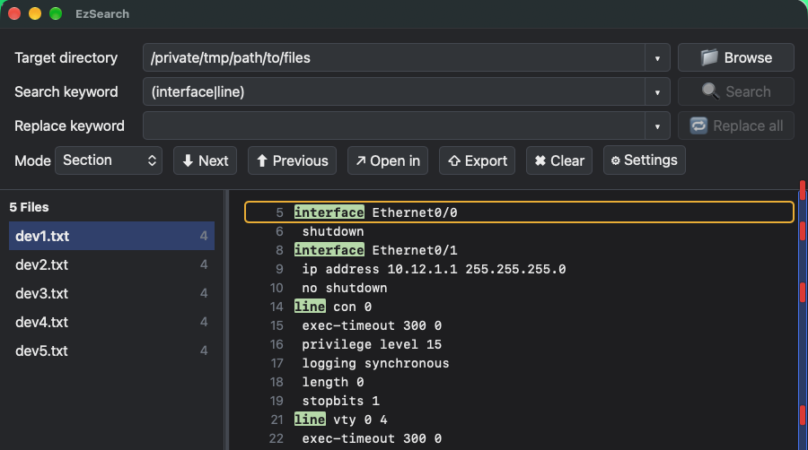

## 検索キーワードを移動する

「→」または「←」（カーソルキーの左右)を押すことで検索キーワードに一致した行を移動できます。

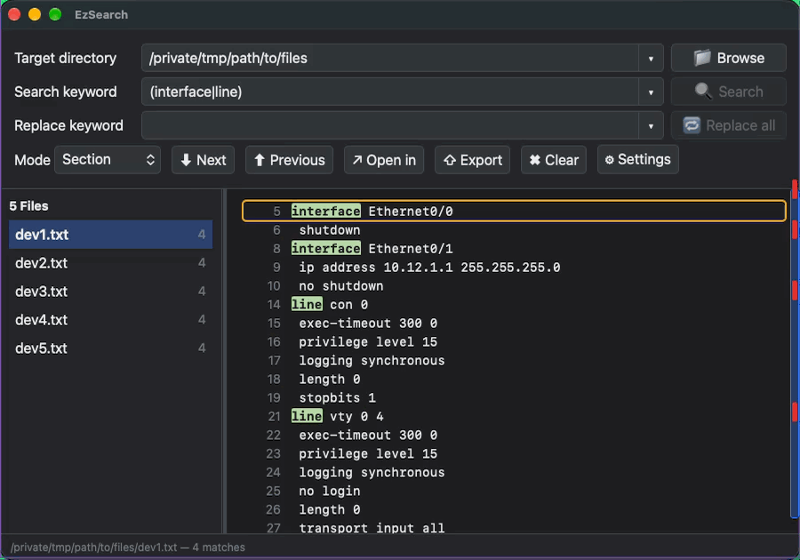

## 検索キーワードの上下行も表示する

検索結果にキーワードと一致した行の上下行も表示するには「`Context lines`」に表示したい行数を設定します(デフォルト：ゼロ)。

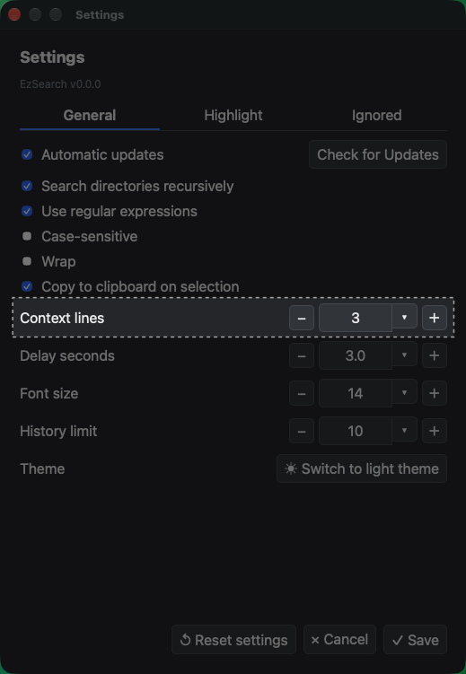

これでキーワードと一致した上下行も結果に表示されます(検索モードによって挙動は異なります)。

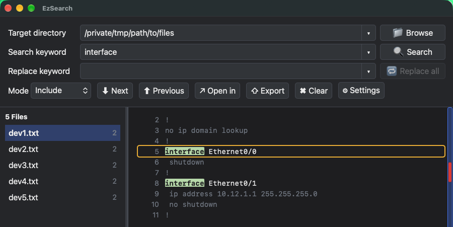

## 検索結果のファイルをファイル名で絞り込む

メインウインドウ左下の「Files」の上にあるテキストエリアにファイル名を入力すると、検索結果として「Files」に表示されているファイルのうち、ファイル名が一致するファイルだけを表示します。

- 入力後、Settingsの「`Delay seconds`」で指定した時間が経過すると自動的に絞り込みます。Enterキーまたは右側のボタンをクリックすると、すぐに絞り込みます
- ファイル名（ディレクトリを除いた部分）に入力した文字列を含むファイルが一致します。大文字と小文字は区別しません
- Settingsの「`Use regular expressions`」が有効な場合は、入力した文字列を正規表現として扱い、ファイル名の一部に一致するファイルを表示します（例: `\.log$`）。正規表現が正しくない場合はファイルを表示せず、「Files」の見出しに「Invalid file name pattern」と表示します
- 「`Use regular expressions`」が無効な場合、`*`（任意の文字列）や `?`（任意の1文字）を含む文字列はワイルドカードとして扱い、ファイル名全体と照合します（例: `*.log`）
- テキストエリアが空欄の場合は絞り込みを行わず、すべてのファイルを表示します
- 入力した文字列は、Settingsの「`History limit`」で指定した件数まで履歴として保存されます

## 対象ファイルをアプリケーションで開く

参照中のファイルを普段利用しているエディタなどで開きたい場合は、検索結果ウインドウ上部のタイトルバー右端（「End」ボタンの右側）にある「Open in」ボタン（アイコンのみ表示）をクリックします。検索結果ウインドウを分割表示している場合は、各ウインドウのボタンでそれぞれ表示中のファイルを開きます。

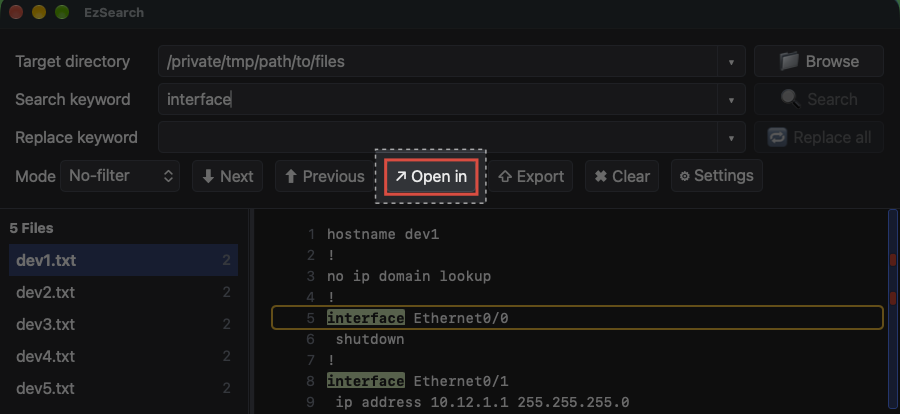

## 検索結果をHTMLファイルとして保存する

「`Export`」をクリックすることで検索結果をHTMLファイルとして保存することができます。

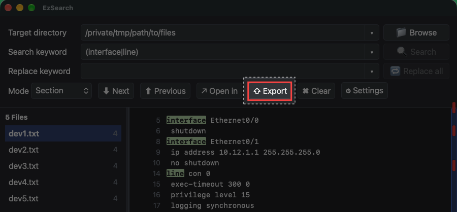

保存されたHTMLファイルをWebブラウザで開くと以下のように表示されます。

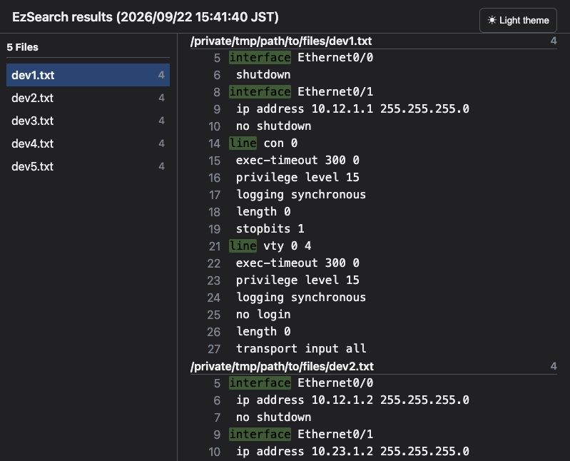

## 2つのファイルを比較する

検索結果ウインドウを分割表示（上下分割または左右分割）している場合、「`Diff`」をクリックすると、各検索結果ウインドウで表示中の2ファイルを比較した結果が専用の「Diffウインドウ」に表示されます。検索結果ウインドウが分割されていない場合、「`Diff`」はクリックできません。

Diffウインドウでは、メインウインドウの分割方向にかかわらず、常に左右に並べて差分を表示します。左側には1つ目（上または左）の検索結果ウインドウのファイルが、右側には2つ目（下または右）の検索結果ウインドウのファイルが表示されます。

- 削除された行は赤、追加された行は緑の背景で表示され、変更された行は変更箇所の単語が強調表示されます
- 変更のない行は前後3行を残して折りたたまれます。折りたたまれた行をクリックすると展開されます（「`Collapse unchanged lines`」のチェックを外すと全行を表示します）
- ツールバーのボタンは左から「Top」「Previous」「Next」「End」です。「Previous」「Next」（↑ / ↓）で前・次の変更箇所へ、「Top」「End」（Home / End）で先頭・最後へ移動できます
- 「`Export`」をクリックすると、Diff結果をHTMLファイルとして保存できます（既定のファイル名は `diff-yyyymmdd-HHMMSS.html`）。保存されるのは折りたたみのない全行です
- 右端のバーには変更箇所の位置が表示され、クリックするとその位置へ移動します
- 「`Reload`」をクリックすると、ファイルを再度読み込んで比較し直します

## キーワードを置換する

キーワードを一括置換するには「`Search keyword`」と「`Replace keyword`」を入力した状態で「`Replace all`」をクリックします。

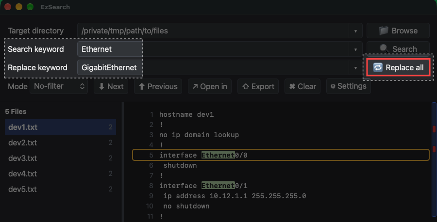

これで一括置換が実行されました。尚、一括置換後のファイルは自動的に上書き保存されます。重用なファイルを置換する際などは事前にバックアップを作成してください。

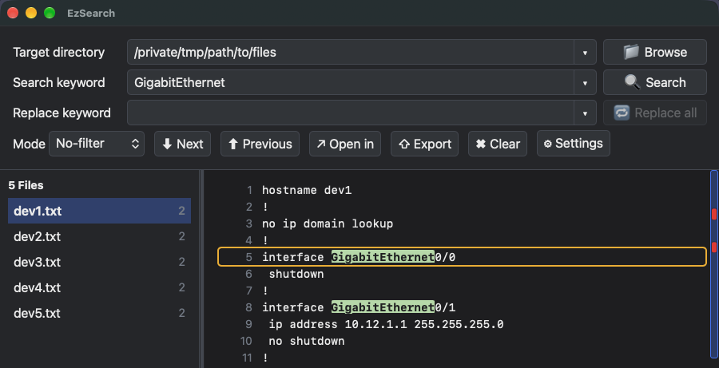

## 設定ファイル

OSごとに以下のパスへ設定ファイルが作成されます。

| OS | 設定ファイル |
| --- | --- |
| macOS / Linux | `~/.config/EzSearch/config.yml` |
| Windows | `%USERPROFILE%/.config/EzSearch/config.yml` |

GUI上の設定項目と設定ファイルの項目は以下のように対応します。

### Generalタブ

| GUI設定項目 | YAMLの設定名 | デフォルト値 | 説明 |
| --- | --- | --- | --- |
| Target directory | `target_directory` | `""` | 検索対象ディレクトリ。 |
| Type（メインウインドウ） | `type` | `""` | キーワードの文字色を付けるTypeです。`""`は「`-`」(色を付けない)を意味します。 |
| Automatic updates | `auto_update` | `true` | 起動時などに更新確認を行います。 |
| Use regular expressions | `regex` | `true` | 検索キーワードを正規表現として扱います。 |
| Case-sensitive | `case_sensitive` | `false` | 大文字と小文字を区別します。 |
| Search directories recursively | `recursive` | `true` | サブディレクトリを再帰的に検索します。 |
| Wrap | `wrap` | `false` | 長い検索結果行を折り返して表示します。 |
| Copy to clipboard on selection | `copy_on_selection` | `true` | 検索結果の選択範囲をクリップボードへコピーします。 |
| Context lines | `context_lines` | `0` | 一致行の前後に表示するコンテキスト行数です。 |
| Delay seconds | `delay_seconds` | `3` | 入力変更後に自動検索を開始するまでの秒数です。最小値は3秒です。 |
| History limit | `history_limit` | `10` | ディレクトリ・検索語・置換語・ファイル名の履歴件数です。 |
| Font size | `font_size` | `14` | 検索結果の文字サイズです。 |
| Theme | `theme` | `"system"` | テーマです。`system`、`light`、`dark`を指定できます。 |

### Ignoredタブ

| GUI設定項目 | YAMLの設定名 | デフォルト値 | 説明 |
| --- | --- | --- | --- |
| Ignored files | `ignored_files` | `*.db`, `*.dll`, `*.dylib`, `*.exe`, `*.gif`, `*.jpeg`, `*.jpg`, `*.out`, `*.png`, `*.rar`, `*.retry`, `*.so`, `*.webp`, `*.zip`, `*.docx`, `*.docm`, `*.doc`, `*.xlsx`, `*.xlsm`, `*.xls`, `*.pptx`, `*.pptm`, `*.ppt`, `*.accdb`, `*.mdb`, `*.pst`, `*.ost`, `*.one`, `*.pub`, `*.vsd`, `*.vsdx`, `.DS_Store`, `.Trashes`, `Thumbs.db`, `desktop.ini`, `$RECYCLE.BIN` | 検索対象から除外するファイル名・拡張子のパターン一覧です。 |

## ショートカットキー一覧

アプリケーション全体では以下のショートカットキーを利用することができます。

| ショートカット1 | ショートカット2 | 説明                                   |
|-----------------|-----------------|----------------------------------------|
| Ctrl+F          | Cmd+F           | フォーカスを「検索キーワード」欄へ移動 |
| Ctrl+R          | Cmd+R           | 「Reset」(検索キーワード等を初期化。Filesは保持) |
| Ctrl+O          | Cmd+O           | 「Open」(検索対象のディレクトリを追加) |
| Ctrl+Shift+R    | Cmd+Shift+R     | Filesの「Clear」(検索対象をすべて削除) |
| PageDown        | -               | 次のファイルへ移動                     |
| PageUp          | -               | 前のファイルへ移動                     |
| End             | -               | 検索結果の最後へ移動                   |
| Home            | -               | 検索結果の先頭へ移動                   |
| ↓               | Ctrl+N          | 次のキーワードへ移動                   |
| ↑               | Ctrl+P          | 前のキーワードへ移動                   |
| Ctrl+↓          | Cmd+↓           | すべての検索結果で次のキーワードへ移動 |
| Ctrl+↑          | Cmd+↑           | すべての検索結果で前のキーワードへ移動 |
| Shift+↓         | -               | 検索結果を一行下にスクロール           |
| Shift+↑         | -               | 検索結果を一行上にスクロール           |
| Ctrl+¥          | -               | 検索結果を縦分割/解除                  |
| Ctrl+-          | -               | 検索結果を横分割/解除                  |
| Ctrl+D          | Cmd+D           | (分割時)Diffウインドウを表示           |
| →               | Ctrl+Tab        | (分割時)次の検索結果ウインドウへ移動   |
| ←               | Ctrl+Shift+Tab  | (分割時)前の検索結果ウインドウへ移動   |

Diffウインドウでは以下のショートカットキーを利用することができます。

| ショートカット1 | ショートカット2 | 説明                 |
|-----------------|-----------------|----------------------|
| ↓               | -               | 次の変更箇所へ移動   |
| ↑               | -               | 前の変更箇所へ移動   |
| Home            | -               | 先頭へ移動           |
| End             | -               | 最後へ移動           |
